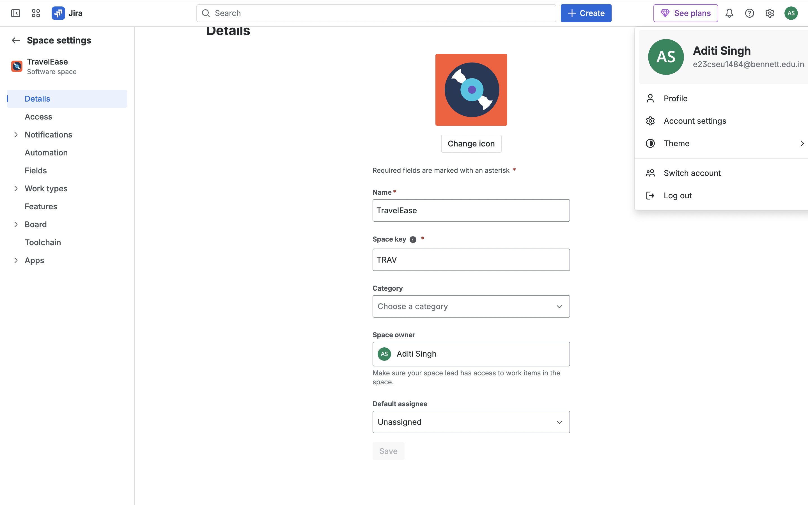
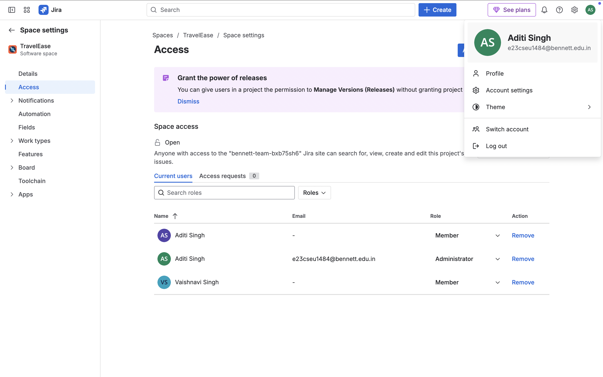
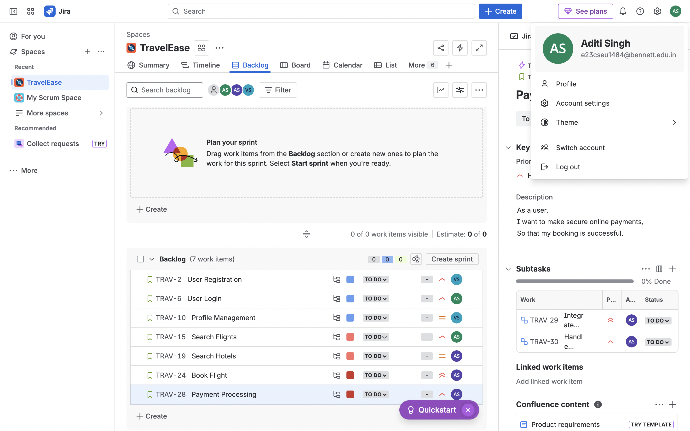
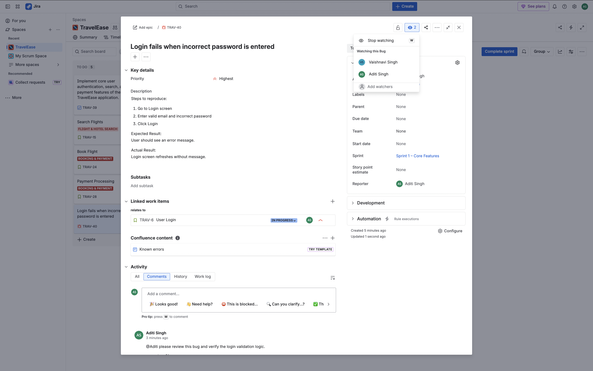
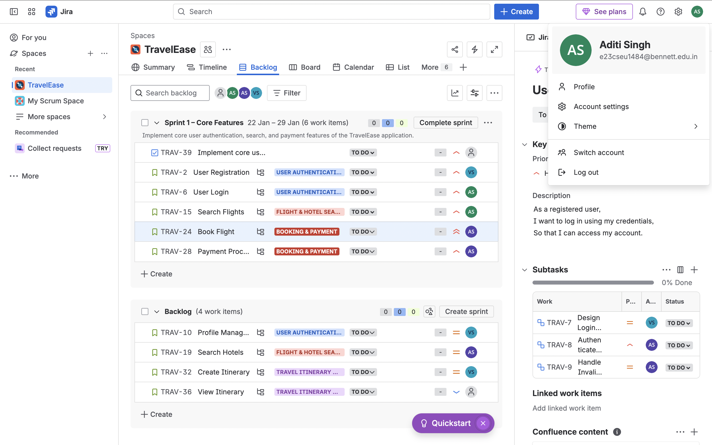
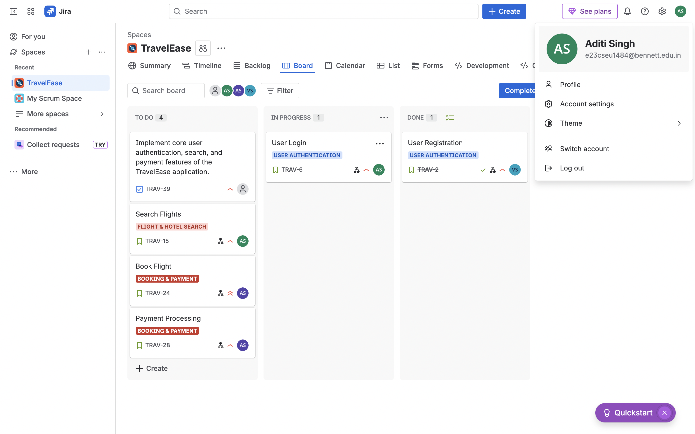
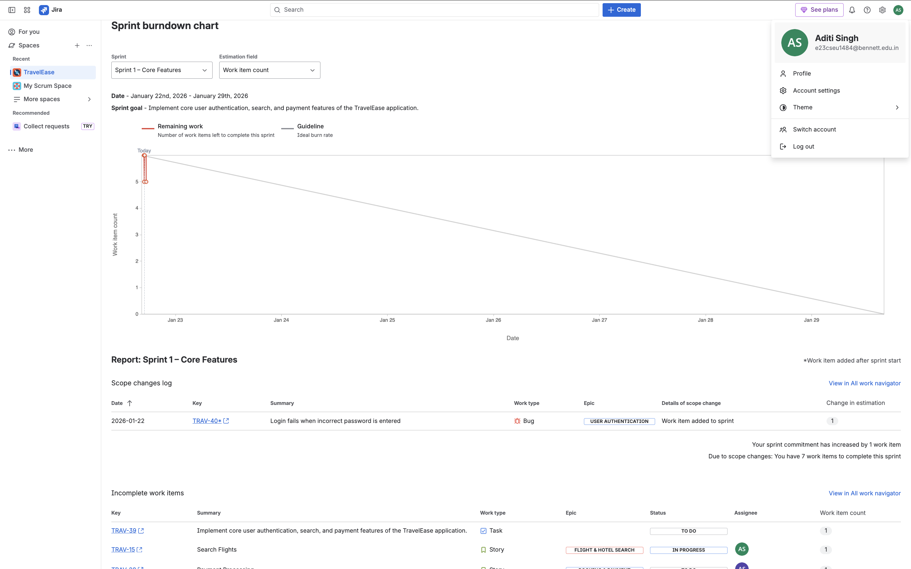
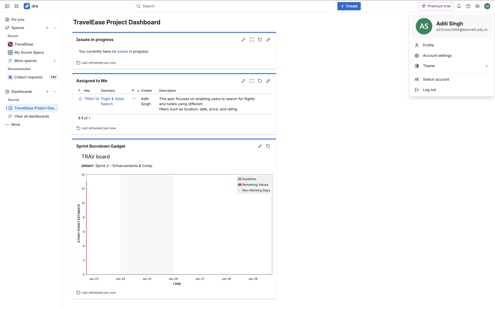

# 📌 Jira for Software Project Management

## 🔹 What is Jira?
**Jira** is an industry-standard project management and issue-tracking tool widely used by software teams to plan, track, and manage work using **Agile and Scrum methodologies**. It helps teams organize tasks, collaborate efficiently, and monitor project progress through reports and dashboards.

---

## 🔹 Use Case
This repository demonstrates the use of **Jira for managing a hypothetical software development project – TravelEase**, following real-world Agile practices such as sprint planning, issue tracking, collaboration, and performance analysis.

---

## 🚀 What I Implemented & Learned

### ✅ Project Setup & Configuration
- Created a **Scrum-based Jira project**
- Configured project details, user roles, and access permissions
- Defined issue types: **Epic, Story, Task, Bug, Sub-task**
- Worked with Agile workflow: **To Do → In Progress → Done**

  
  

---

### ✅ Issue Types & Workflow Design
- Used appropriate issue types for Agile development
- Understood how Jira handles priorities, layouts, and sub-tasks
- Applied structured workflows for tracking progress

  
  

---

### ✅ Agile Planning (Scrum)
- Broke requirements into **Epics → Stories → Sub-tasks**
- Planned work using **multiple sprints**
- Defined clear **Sprint Goals**
- Applied **story point estimation (Fibonacci: 2, 3, 5)**

---

### ✅ Sprint Execution & Progress Tracking
- Started and completed sprints
- Moved work items across statuses to simulate real development
- Managed scope changes during active sprints
- Tracked progress using the Scrum Board

  
  

---

### ✅ Issue Management & Collaboration
- Created and managed bugs and feature requests
- Assigned issues to team members
- Used **comments and @mentions** for collaboration
- Linked related issues (Bug ↔ Story)
- Added watchers and attachments

---

### ✅ Reporting & Analysis
- Analyzed **Sprint Burndown Charts** to monitor sprint health
- Understood **Velocity Charts** and their dependency on story points
- Interpreted reports to evaluate progress and capacity

---

### ✅ Dashboard Creation
- Built a **custom Jira dashboard** with:
  - Sprint Burndown Gadget
  - Issue Statistics (by status)
  - Assigned-to-me view
- Used dashboards for centralized project monitoring

---

## 🎯 Key Skills Demonstrated
- Agile & Scrum methodology
- Sprint planning and execution
- Issue lifecycle management
- Team collaboration using Jira
- Reporting and performance analysis
- Hands-on Jira project management

---

## 🧠 Learning Outcome
This project strengthened my understanding of how **real-world software teams use Jira** to manage projects end-to-end — from requirement breakdown and sprint planning to collaboration, tracking, and performance analysis.

---

